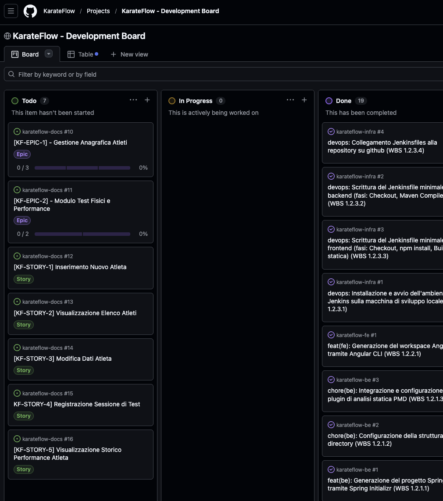

# 📔 Diario di Bordo Fase 2: Analisi Funzionale e Raccolta dei Requisiti

## 📅 Dettagli della Fase
**Periodo**: 04 Giugno / 07 Giugno 2026 
**Stato**: ✅ Completata
**Obiettivo**: Definizione dei requisiti e delle funzionalità core dell'applicazione. 

---

## 🎯 Obiettivi Raggiunti
In questa sessione abbiamo completato l'intera infrastruttura documentale e di governance necessaria per avviare lo sviluppo tecnico.

### 1. Espansione della WBS e Scomposizione Gerarchica
*   Dettagliata la **Fase 2** in 3 Work Package principali (WP 2.1, 2.2, 2.3).

### 2. Modellazione del Dominio e Schema Dati
*   Creato il file `analisi/domain-model.md`.
*   Definite le collection MongoDB:
    *   `athletes`: Gestione anagrafica e note mediche.
    *   `test_execution`: Sessioni di test granulari con supporto per array di esercizi.
*   Definita la strategia di relazione tramite **Reference (1:N)** per garantire scalabilità.

### 3. Formalizzazione dei Requisiti e BDD
*   Mappatura degli **Attori** (Coach e Atleta) con relativi confini di visibilità.
*   Stesura di **2 Epiche** e **5 User Story** (da `KF-1` a `KF-5`).
*   Definizione degli scenari di test in formato **Gherkin/BDD** per ogni story.

### 4. Governance e Board su GitHub
*   Caricamento delle Epiche e delle User Story nella colonna **"To Do"** della **KarateFlow - Development Board** su GitHub Projects..
*   Mappatura della gerarchia tramite tasklist native e collegamenti bidirezionali tra documentazione e ticket.
*   Classificazione per priorità e assegnazione preliminare dei metadati.

---

## 📸 Stato della Board
Di seguito lo screenshot della bacheca configurata con i requisiti dell'MVP:

---

## ⏭️ Prossimi Passi
La prossima fase (**Fase 3: Sviluppo Core Backend**) si concentrerà sull'implementazione dei servizi REST per la gestione degli atleti e sulla persistenza su MongoDB.
