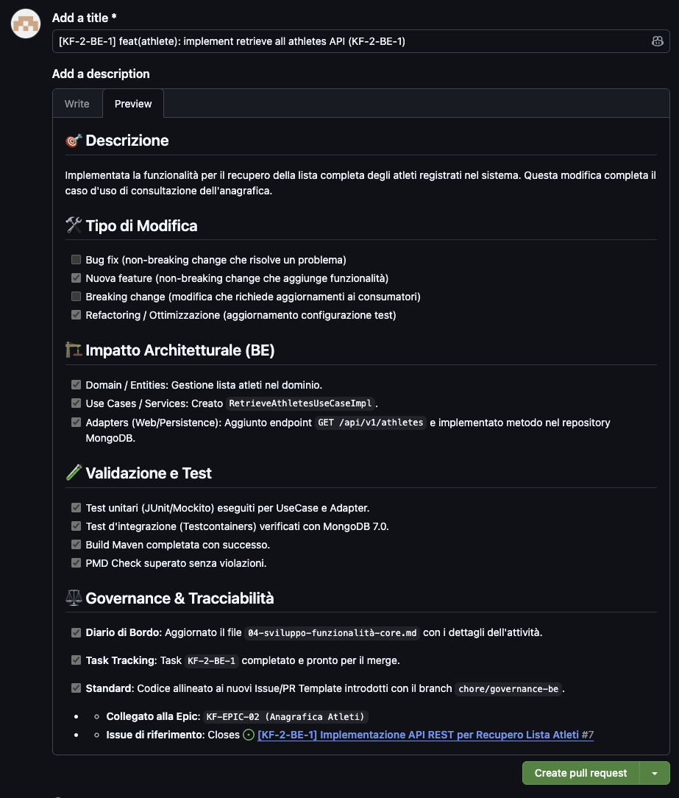
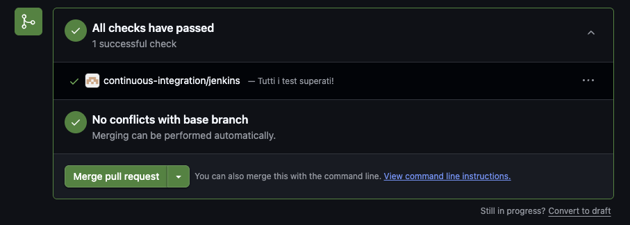

# 📔 Diario di Bordo Fase 4: Sviluppo Funzionalità Core

## 📅 Dettagli della Fase
**Stato**: 🏗️ In Corso
**Obiettivo**: Sviluppo delle funzionalità core del sistema (Gestione Atleti e Sessioni di Test).

---

## 🚀 Avanzamento Story 1 (KF-1)

### Descrizione dell'Attività e Cambiamento di Scope

La Story 1, inizialmente stimata in 4 task lineari incentrati sulla scrittura del codice di persistenza e dei relativi test, ha subìto un'espansione programmata a 14 task complessivi. Questo incremento è stato necessario per isolare, tracciare e correggere una serie di blocker infrastrutturali emersi esclusivamente con il server di Continuous Integration (Jenkins).

### Analisi dei Problemi e Soluzioni Adottate
Il completamento della storia ha richiesto una profonda attività di analisi (Troubleshooting) focalizzata su quattro aree critiche:

1.  **Disattivazione del Conflitto Statico**: Rimossa l'interferenza della classe legacy `MongoConfig` (che forzava la connessione a localhost:27017 con credenziali di amministrazione) durante la suite di test mediante l'applicazione mirata del profilo `@Profile("!test")`.
2.  **Allineamento a Spring Boot 4.0.6**: Intercettato il cambiamento del dizionario delle proprietà del framework (rimozione del token intermedio `.data.`), adeguando il registro dinamico alle nuove chiavi `spring.mongodb.uri`.
3.  **Ottimizzazione del Context Caching**: Risolto il conflitto di ciclo di vita tra JUnit 5 e Spring Boot (causa di timeout sistematici dovuti alla distruzione e ricreazione dei container Mongo tra classi di test diverse) mediante la centralizzazione di una classe base astratta ereditata.
4.  **Risoluzione Blocker DinD (Docker-in-Docker) su Jenkins**: Isolato il fallimento del container di pulizia delle risorse (Ryuk), legato alla mancata comunicazione tra il container di Jenkins e il socket dell'host, stabilizzando l'ambiente CI.

### Governance e Standardizzazione
Per garantire un processo di sviluppo fluido e allineato agli standard di qualità del progetto, è stata introdotta una struttura di governance basata su template GitHub:
- **Issue Templates**: Creati template specifici per `bug_report` e `feature_task` in tutti i repository (`be`, `fe`, `infra`), con metadati preconfigurati (labels, assignees) e strutture dedicate ai diversi ambiti tecnici (es. Clean Architecture per il Backend, UX/UI per il Frontend).
- **Pull Request Templates**: Implementati template per le PR che forzano una checklist di validazione (test unitari, d'integrazione, linting e build) prima del merge.
- **Workflow**: I template sono stati distribuiti tramite branch dedicati (`chore/governance-*`) per non interferire con il flusso di sviluppo delle feature correnti.

*Esempio del template di Pull Request applicato correttamente.*

*Validazione automatica di Jenkins sul branch di feature prima del merge.*

---

## ⏭️ Prossimi Passi
*   Completamento della Story 1.
*   Avvio dello sviluppo della Story 2 (Gestione Sessioni di Test).
