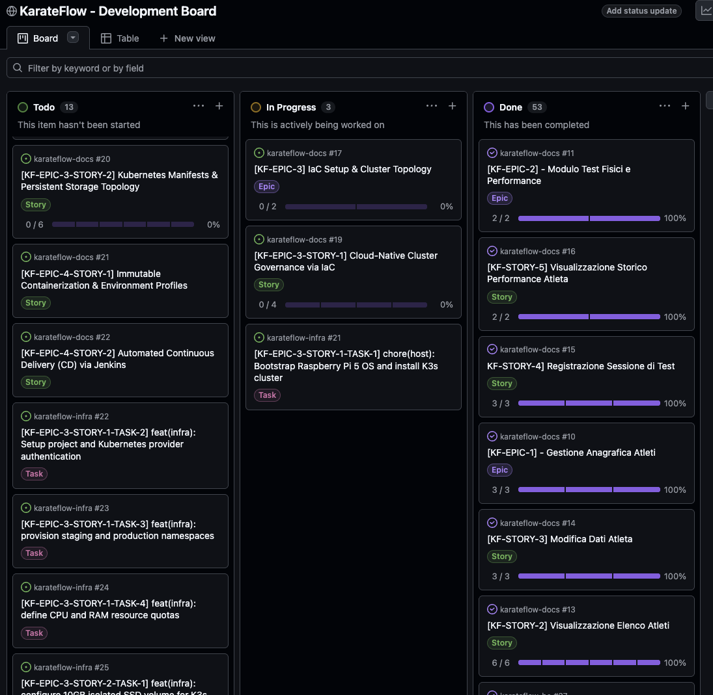

# 📔 Diario di Bordo Fase 4: Provisioning Infrastruttura

## 📅 Dettagli della Fase
* **Periodo**: Terza e Quarta settimana di Giugno 2026
* **Stato**: 🟡 In Corso (KF-EPIC-3 Completata, KF-EPIC-4 da avviare)
* **Obiettivo**: Provisioning dell'infrastruttura cloud-native (K3s) su Raspberry Pi 5 tramite IaC (Terraform), containerizzazione dei servizi ed estensione delle pipeline di CD su Jenkins.

---

## 🎯 Obiettivi Raggiunti & Governance (Avvio della Fase)

In questa fase iniziale abbiamo impostato la governance e strutturato il backlog delle attività necessarie per il provisioning infrastrutturale. Seguendo la metodologia *Rolling Wave Planning*, abbiamo dettagliato e scomposto i requisiti in Epiche, User Story e Task su GitHub.

Con la conclusione della prima Epica (**KF-EPIC-3**), abbiamo abilitato il cluster e configurato la persistenza dei dati e la connettività sicura da remoto.

### Strutturazione del Backlog su GitHub
Abbiamo formalizzato e caricato sulla bacheca di progetto:
1. **2 Epiche di Progetto** legate a questa fase:
   * **`KF-EPIC-3`**: IaC Setup & Cluster Topology (Completata)
   * **`KF-EPIC-4`**: Containerization & Continuous Delivery (In Corso)
2. **4 User Story** (2 per ciascuna Epica):
   * **`KF-EPIC-3-STORY-1`**: Cloud-Native Cluster Governance via IaC (Completata)
   * **`KF-EPIC-3-STORY-2`**: Kubernetes Manifests & Persistent Storage Topology (Completata)
   * **`KF-EPIC-4-STORY-1`**: Immutable Containerization & Environment Profiles (In Corso)
   * **`KF-EPIC-4-STORY-2`**: Automated Continuous Delivery (CD) via Jenkins (Programmata)

---

## 🚀 Stato Avanzamento: Completamento KF-EPIC-3

Abbiamo completato tutti i 10 task associati alla prima epica di infrastruttura. Il cluster K3s locale su Raspberry Pi 5 è ora operativo, configurato in modalità dichiarativa tramite Terraform e accessibile in modo sicuro dall'esterno.

### Dettaglio dei Risultati Raggiunti:
1. **Cluster K3s & IaC (`KF-EPIC-3-STORY-1`)**:
   - Eseguito il bootstrap e la configurazione iniziale del sistema operativo del Raspberry Pi 5 e l'installazione del cluster Kubernetes lightweight (K3s).
   - Impostato il progetto Terraform per l'autenticazione dichiarativa sul provider Kubernetes.
   - Creati tramite IaC i namespace isolati `karateflow-stg` (staging) e `karateflow-prod` (produzione).
   - Definite Resource Quotas (limiti CPU e RAM) per ciascun namespace per evitare che anomalie o memory leak su un ambiente possano intaccare la stabilità dell'altro o dell'intero host.

2. **Manifesti K8s, Storage & Networking (`KF-EPIC-3-STORY-2`)**:
   - Configurato un volume SSD isolato da 10GB montato sull'host Raspberry Pi per il local-path storage provider di K3s.
   - Creati i manifesti di deployment stateful per MongoDB con un PersistentVolumeClaim (PVC) limitato a 3GB per garantire la persistenza dei dati del database.
   - Scritti e applicati i manifesti dei deployment e dei relativi servizi ClusterIP per il backend (`karateflow-be`) e per il frontend (`karateflow-fe`).
   - Configurato l'Ingress Traefik nativo di K3s per gestire il routing interno delle richieste HTTP.
   - **Tunneling Cloudflare**: Installato il daemon ufficiale `cloudflared` all'interno del cluster per esporre i servizi tramite un tunnel cifrato HTTPS, evitando la necessità di configurare port forwarding sul router di casa e bloccando l'accesso non autorizzato.
   - **Dominio Remoto**: Acquistato e collegato il dominio **`karate-flow.com`** tramite Cloudflare Tunnel per consentire una navigazione remota diretta e protetta verso l'applicazione web in produzione.

### 📸 Stato della Board (Inizio Fase 4)
Di seguito viene mostrato lo screenshot della bacheca GitHub all'inizio della Fase 4, prima dello sviluppo e della chiusura dei 10 task completati in questa epica:

---

## 🗺️ Dettaglio di Epiche e Stories

### 🌐 [KF-EPIC-3] IaC Setup & Cluster Topology (Stato: ✅ Completata)
Questa Epica ha l'obiettivo di automatizzare il provisioning dell'infrastruttura. Applicando i principi dell'Infrastructure as Code (IaC) e dell'orchestrazione cloud-native, si definisce un ambiente di esecuzione sicuro, isolato a livello di rete (Kubernetes Namespaces) e limitato a livello hardware (Resource Quotas) per consentire la coesistenza di Staging e Produzione sul Raspberry Pi 5.

*   **[KF-EPIC-3-STORY-1] Cloud-Native Cluster Governance via IaC** (Stato: ✅ Completata)
    *   *Obiettivo*: Effettuare il provisioning dei namespace (`karateflow-stg`, `karateflow-prod`) ed impostare quote hardware (CPU/RAM) tramite Terraform.
    *   *Task completati*:
        *   [x] `KF-EPIC-3-STORY-1-TASK-1`: `chore(host): Bootstrap Raspberry Pi 5 OS and install K3s cluster`
        *   [x] `KF-EPIC-3-STORY-1-TASK-2`: `feat(infra): Setup project and Kubernetes provider authentication`
        *   [x] `KF-EPIC-3-STORY-1-TASK-3`: `feat(infra): provision staging and production namespaces`
        *   [x] `KF-EPIC-3-STORY-1-TASK-4`: `feat(infra): define CPU and RAM resource quotas`
*   **[KF-EPIC-3-STORY-2] Kubernetes Manifests & Persistent Storage Topology** (Stato: ✅ Completata)
    *   *Obiettivo*: Definire i manifesti di deployment, configurare la persistenza del database limitando l'uso del disco (SSD da 10GB per K3s) e configurare il proxy di routing e il tunneling HTTPS.
    *   *Task completati*:
        *   [x] `KF-EPIC-3-STORY-2-TASK-1`: `feat(infra): configure 10GB isolated SSD volume for K3s local-path`
        *   [x] `KF-EPIC-3-STORY-2-TASK-2`: `feat(infra): write MongoDB stateful deployment and 3GB PVC manifest`
        *   [x] `KF-EPIC-3-STORY-2-TASK-3`: `feat(infra): write backend deployment and clusterIP service`
        *   [x] `KF-EPIC-3-STORY-2-TASK-4`: `feat(infra): write frontend deployment and clusterIP service`
        *   [x] `KF-EPIC-3-STORY-2-TASK-5`: `feat(infra): configure Traefik Ingress routing rules for internal resolution`
        *   [x] `KF-EPIC-3-STORY-2-TASK-6`: `feat(infra): deploy Cloudflare Tunnel daemon for secure external access`

---

### 📦 [KF-EPIC-4] Containerization & Continuous Delivery (Stato: 🟡 In Corso)
Questa Epica ha l'obiettivo di colmare il divario tra lo sviluppo locale e automatizzare l'intero ciclo di vita del rilascio software. Attraverso la Containerizzazione, si garantisce che il medesimo artefatto (immagine Docker) testato in locale possa girare senza alterazioni su K3s, governando le differenze ambientali esclusivamente tramite configurazioni di profilo (Staging vs Prod). Inoltre, l'estensione delle pipeline CI/CD introduce la Continuous Delivery, abbattendo il tempo di deploy ed eliminando l'intervento manuale post-merge.

*   **[KF-EPIC-4-STORY-1] Immutable Containerization & Environment Profiles** (Stato: 🟡 In Corso)
    *   *Obiettivo*: Creare Dockerfile multi-stage leggeri per Backend (con JRE minimale) e Frontend (servito da Nginx) eliminando credenziali o IP hardcoded.
    *   *Task definiti*:
        *   [ ] `KF-EPIC-4-STORY-1-TASK-1`: `feat(be): [Config] setup Spring Boot environment profiles and properties`
        *   [ ] `KF-EPIC-4-STORY-1-TASK-2`: `feat(infra): [Docker] write multi-stage Dockerfile for Spring Boot Backend`
        *   [ ] `KF-EPIC-4-STORY-1-TASK-3`: `feat(fe): [Config] setup Angular environment configurations for staging`
        *   [ ] `KF-EPIC-4-STORY-1-TASK-4`: `feat(infra): [Docker] write multi-stage Dockerfile for Angular Frontend`

*   **[KF-EPIC-4-STORY-2] Automated Continuous Delivery (CD) via Jenkins** (Stato: 📅 Programmata)
    *   *Obiettivo*: Configurare un Docker Registry locale sul Raspberry Pi 5 e aggiornare le pipeline per compilare le immagini, pusharle sul registry ed eseguire il deploy su K3s (`kubectl apply`).
    *   *Task definiti*:
        *   [ ] `KF-EPIC-4-STORY-2-TASK-1`: `feat(infra): [Docker] deploy local registry on K3s and configure local daemon trust`
        *   [ ] `KF-EPIC-4-STORY-2-TASK-2`: `feat(infra): [Pipeline] inject Kubeconfig credentials into existing local Jenkins`
        *   [ ] `KF-EPIC-4-STORY-2-TASK-3`: `feat(infra): [Pipeline] extend BE pipeline with Docker build, push and K8s rollout stages`
        *   [ ] `KF-EPIC-4-STORY-2-TASK-4`: `feat(infra): [Pipeline] extend FE pipeline with Docker build, push and K8s rollout stages`

---

## 🧠 Archivio delle Scelte

*   **Scelta della virtualizzazione leggera (K3s)**: Data la disponibilità limitata di hardware sul Raspberry Pi 5, si è scelto di adottare K3s (una distribuzione Kubernetes leggera) rispetto a Kubernetes standard, riducendo l'overhead di memoria del control plane.
*   **Separazione logica dei Namespace con Resource Quota**: Per impedire che picchi di carico o memory leak nell'ambiente di Staging possano bloccare la produzione o gli altri servizi del Raspberry Pi, abbiamo configurato limiti rigidi di CPU e RAM a livello di Namespace tramite Terraform.
*   **Persistence con local-path provisioner + SSD dedicato**: Per garantire elevate prestazioni di I/O del database MongoDB e preservare i dati in caso di riavvio, viene dedicato un volume SSD da 10GB montato sull'host e cablato tramite un PersistentVolumeClaim (PVC).
*   **Pianificazione incrementale del Backlog (Epic 3 vs Epic 4)**: Abbiamo scomposto in task di dettaglio i micro-task di containerizzazione (Dockerfiles) e automazione del rilascio (Jenkins pipeline CD) solo dopo aver validato empiricamente la topologia del cluster e confermato il funzionamento di K3s e del tunnel.
*   **Adozione del Cloudflare Tunnel e Dominio karate-flow.com**: Invece di aprire porte sul router locale ed esporre l'IP di casa o usare Dynamic DNS instabili, si è scelto di configurare un tunnel HTTPS gestito da Cloudflare. Questo garantisce sicurezza end-to-end e, tramite l'acquisto del dominio `karate-flow.com`, offre un accesso remoto semplice, robusto e dall'aspetto professionale.

---

